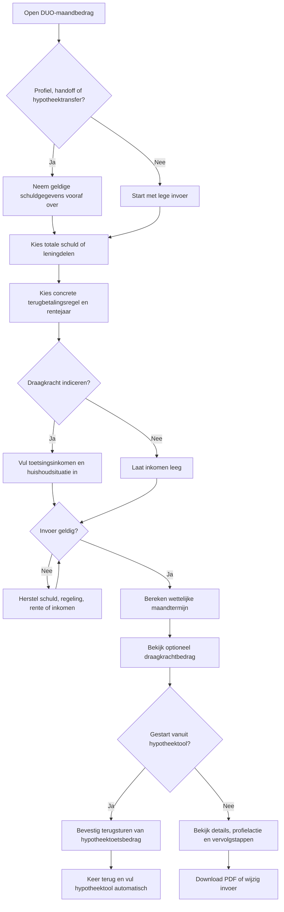
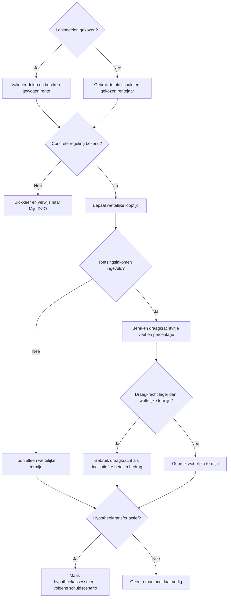
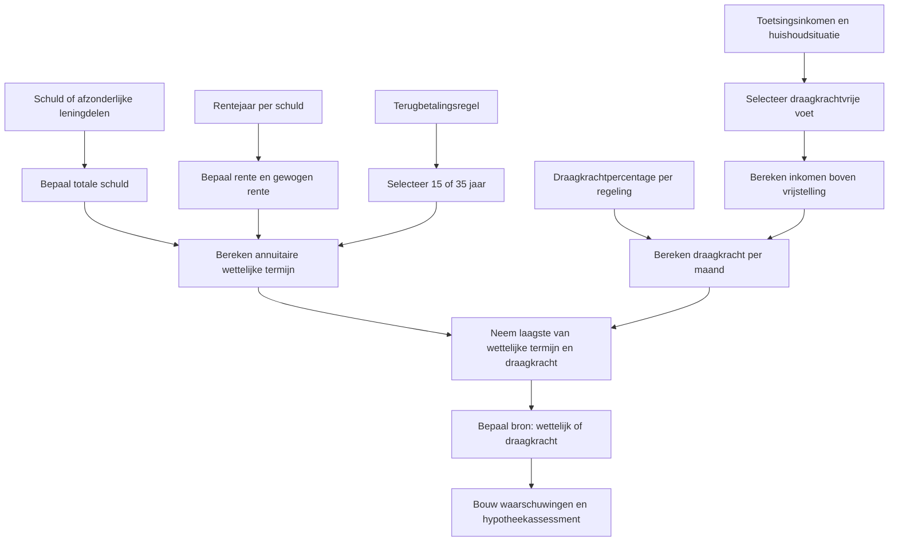
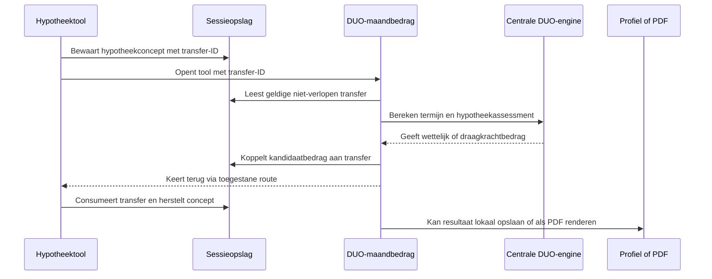

# Procesplaat Wat wordt mijn DUO-maandbedrag?

## 1. Identificatie

- **Tool-ID:** `duo-maandbedrag`
- **Publieke route:** `/apps/duo-maandbedrag`
- **Doel:** de wettelijke DUO-maandtermijn berekenen en optioneel een draagkrachtindicatie tonen, met een gecontroleerde retourflow naar hypotheektools.
- **Gecontroleerd op:** 2026-07-31.
- **Functionele basis:** `apps/duo-maandbedrag/Calculator.tsx`, adapter `apps/duo-maandbedrag/logic.ts` en centrale DUO-functies in `src/lib/duo/calculations.ts`.

## 2. Gebruikersproces

## 3. Beslisproces

## 4. Rekenproces

Voor `SF15_OLD` is geen eenvoudig centraal draagkrachtpercentage beschikbaar; die situatie blijft expliciet beperkt en gewaarschuwd. Rentehistorie, looptijden en draagkrachtregels komen via `src/lib/financial-constants/index.ts`.

## 5. Gegevensstroom en koppelingen

De specifieke hypotheektransfer gebruikt `sessionStorage`, een onvoorspelbaar transfer-ID, een whitelist van retourroutes en een geldigheid van 45 minuten in `src/lib/duo-mortgage-transfer.ts`. Zonder transfer kan profielprefill via `src/lib/profile-tool-mapping.ts` worden gebruikt. Bedragen staan niet in de URL.

## 6. Resultaten en uitzonderingen

| Resultaat of status | Ontstaat uit | Wanneer zichtbaar | Belangrijk voor gebruiker |
| --- | --- | --- | --- |
| Wettelijke maandtermijn | Schuld, rente en wettelijke looptijd | Na geldige berekening | Dit is de termijn volgens het gekozen schuldmodel. |
| Indicatief draagkrachtbedrag | Inkomen boven vrije voet en percentage | Alleen met toetsingsinkomen | DUO stelt draagkracht jaarlijks officieel vast. |
| Hypotheektoetsbedrag | Centrale mortgage-assessmentkeuze | Alleen bij actieve transfer | Kan afwijken van het actueel geïncasseerde bedrag. |
| Gewogen rente | Meerdere leningdelen | Alleen bij leningdelen | Elk deel behoudt eigen rentejaar in de berekening. |
| PDF | Geldige view | Na berekening | Gebruikt hetzelfde resultaat. |

Onbekende regeling, ongeldige schuld, ongeldige leningdelen, een niet-ondersteund rentejaar of negatief inkomen blokkeren. Een ontbrekende, corrupte, verlopen of al verbruikte transfer wordt niet teruggestuurd en toont een herstelmelding.

## 7. Functionele bronverwijzingen

- `apps/duo-maandbedrag/app.json`: publieke identiteit.
- `apps/duo-maandbedrag/Calculator.tsx`: formulier, transferstatus, profiel, resultaat en PDF.
- `apps/duo-maandbedrag/logic.ts`: validatie, portefeuille, draagkracht en transferkandidaat.
- `src/lib/duo/calculations.ts`: wettelijke termijn en draagkrachtindicatie.
- `src/lib/duo/mortgage-assessment.ts`: keuze van relevant hypotheektoetsbedrag.
- `src/lib/duo-mortgage-transfer.ts`: tijdelijke sessie- en retourflow.
- `apps/duo-maandbedrag/report.ts`: PDF uit dezelfde view.
- Regressies: `apps/duo-maandbedrag/logic.test.ts`, `apps/duo-maandbedrag/report.test.ts` en `src/lib/duo/mortgage-assessment.test.ts`.
